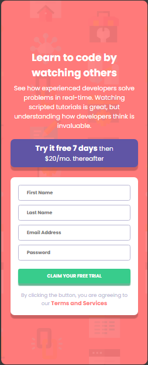

# intro-component-with-signup-form-master
Intro Component with Signup form master

This is a solution to the [intro-component-with-signup-form-master challenge on Frontend Mentor](https://www.frontendmentor.io/challenges/intro-component-with-signup-form-5cf91bd49edda32581d28fd1). Frontend Mentor challenges help you improve your coding skills by building realistic projects. 

## Table of contents

- [Overview](#overview)
  - [Screenshot](#screenshot)
  - [Links](#links)
- [My process](#my-process)
  - [Built with](#built-with)
  - [What I learned](#what-i-learned)
  - [Continued development](#continued-development)
- [Author](#author)

## Overview

### Screenshot

These are my screenshots showing how the project turned out.

- Desktop design:


- Mobile design:



- Active state:


### Links

- Solution URL: [My Solution](https://gillaercio.github.io/intro-component-with-signup-form-master/)

## My process

### Built with

- Semantic HTML5 markup
- CSS custom properties
- Grid Layout
- Mobile-first workflow
- JavaScript

### What I learned

I took advantage of this project to practice the use of **JavaScript**:

arrays

```js
const fields = [
  {element: firstName, placeholder: "First Name", message: "First Name cannot be empty"},
  {element: lastName, placeholder: "Last Name", message: "Last Name cannot be empty"},
  {element: email, placeholder: "Email Address", message: "Looks like this is not an email"},
  {element: pass, placeholder: "Password", message: "Password cannot be empty"}
];
```

email validation

```js
if (input === email && input.value.trim() !== "") {
  const emailPattern = /^[^\s@]+@[^\s@]+\.[^\s@]+$/;
  hasError = !emailPattern.test(input.value.trim());
}
```

### Continued development

I would like to improve my use of **JavaScript**, to delve deeper into concepts such as arrays, repetition structures, form field validation, etc.

## Author

- Frontend Mentor - [@gillaercio](https://www.frontendmentor.io/profile/gillaercio)
- Github - [My Github](https://github.com/gillaercio)
- LinkedIn - [My LinkedIn](https://www.linkedin.com/in/gildman-la%C3%A9rcio/)